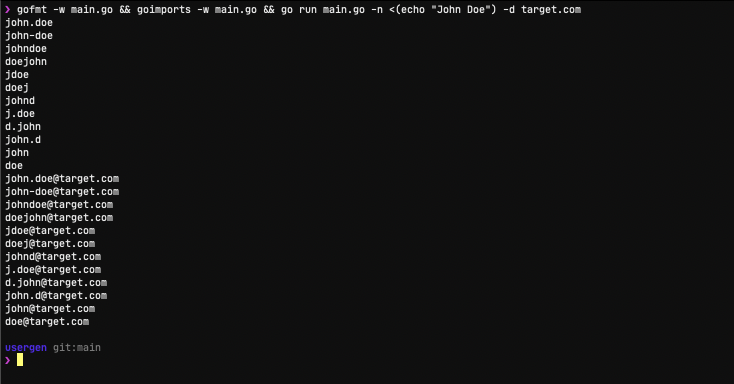

# usergen
usergen is a basic tool that takes a list of names and generates usernames with common username/email formats.



### Usage

```bash
# only usernames, no emails
usergen -n names.txt
# usernames and emails
usergen -n names.txt -d target.com --save usernames.txt
# write generated usernames and emails to stdout
usergen -n names.txt -d target.com
```

### Install From Source

**NOTE**: must have `GOPATH` environment variable in your PATH and obviously go installed
```
go install -v github.com/bin3xish477/usergen
```
